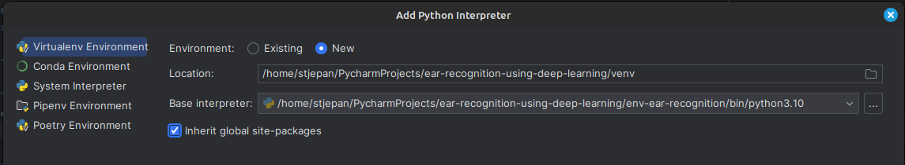
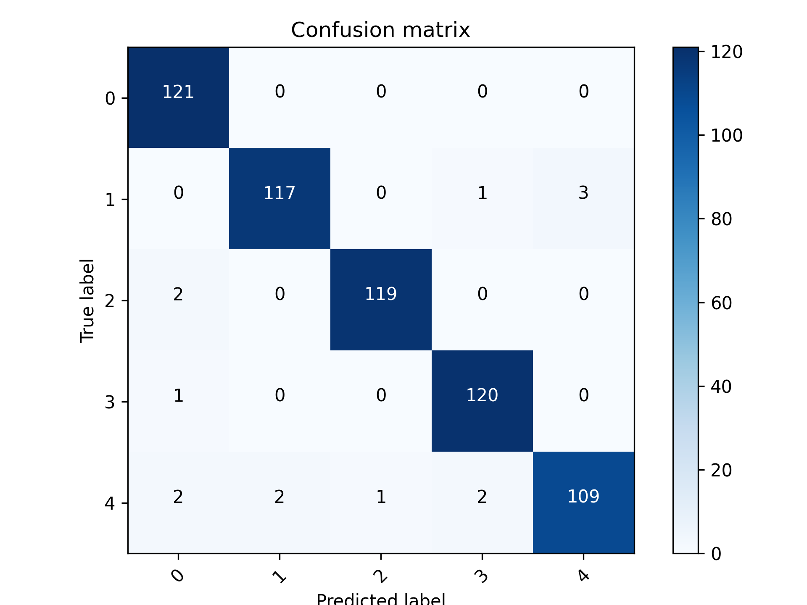
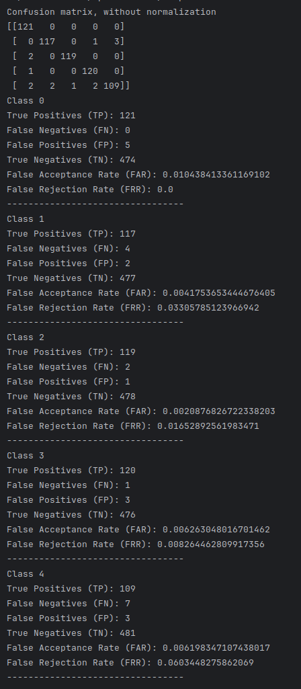
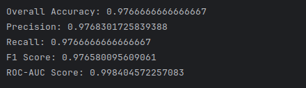
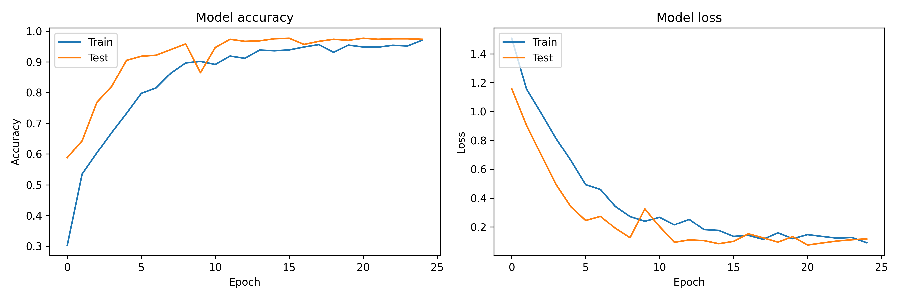

# Ear recognition using deep learning

## Setup project environment (Linux)

Ensure you have Python 3.8 and pip python package manager or later installed on your Linux machine. You can download it from the official Python website https://www.python.org/downloads/.
To check if Python is installed, use in terminal: `python --version` or `python3 --version`. To install pip package manager run: `sudo apt install python3-pip`.

It's recommended to create a virtual environment to install the project's dependencies. Here's how you can do it:
1. Install the virtual environment package: `pip install virtualenv` (if you get a warning that virtualenv script is installed in directory which is not in $PATH, you should go into directory where it is installed - for me it was `/home/stjepan/.local/bin` - and move it into `/usr/local/bin`)
2. In terminal navigate to your project directory and create a virtual environment with: `virtualenv env-chosen-name` - if it is successful, you should see new directory in your project root named `env-chosen-name`
3. Activate the virtual environment: `source env-chosen-name/bin/activate` (You should see (env) prefixed to your terminal indicating that the virtual environment is now active.)

Install the project's dependencies with: `pip install numpy opencv-python tqdm scikit-learn keras`.
If you want to use PyCharm IDE for running scripts on click you need to install it with PyCharm going to "Interpreter Settings". Before installing it with PyCharm if you created new virtual environment it is recommended to add new python interpreter for virtual environment by going to "Add interpreter":

## Database selection and preparation:

Ear images are downloaded from https://webctim.ulpgc.es/research_works/ami_ear_database/ and stored in the `data/01_raw` folder.

In terminal go to `src/data/` directory and run `python3 prepare_data.py` to prepare the data for model, or you can open script `prepare_data.py` with PyCharm and click green triangle to run the script. The script will:
- delete images of left ears,
- resize images to 128 pixels in width and store it in `data/02_resized` directory,
- augment images and store it in `data/03_augmented` directory,
- resized images and augmented images will convert to grayscale and stored in `data/04_augmented` directory.

## Working with model:

In terminal go to `src/` directory and run `python3 main.py`, or you can open script `prepare_data.py` with PyCharm and click green triangle to run the script. The script will:
- split data for training, validation and test set, and preprocess labels for model training:
  - There is 5 labels/classes in total. Labels/classes are representing 4 persons:
    - "0" person, 
    - "1" person, 
    - "2" person, 
    - "3" person,
    - and there is one more label "4" for unknown person.,
- work with model: create model, train model, evaluate model, save model, predict with model,
- plot model training history, statistics (FAR, FRR) and plot confusion matrix for accuracy visualization.

## Predicting with model:

In terminal go to `src/` directory and run `python3 predict.py`, or you can open script `predict.py` with PyCharm and click green triangle to run the script. The script will:
- load model,
- read image from `data/new_data.jpg`,
- predict with model,
- print predicted label.

## Performance evaluation:

There is 5 labels/classes in total. Labels/classes are representing 4 persons:
- "0" person, 
- "1" person, 
- "2" person, 
- "3" person,
- and there is one more label "4" for unknown person.

### The model achieved 97.67% accuracy on test set. The confusion matrix is shown below:

### Metrics such as False Acceptance Rate (FAR), False Rejection Rate (FRR) and others are shown below:

### Histogram of model training history is shown below:

